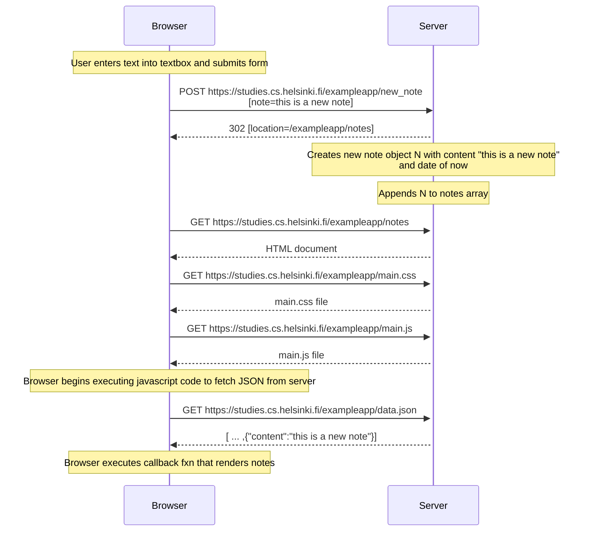

```mermaid
sequenceDiagram
    Participant B as Browser
    Participant S as Server
    Note over B: User enters text into textbox and submits form
    B->>S: POST https://studies.cs.helsinki.fi/exampleapp/new_note<br>[note=this is a new note]
    Activate S
    S-->>B: 302 [location=/exampleapp/notes]
    Note over S: Creates new note object N with content "this is a new note"<br>and date of now
    Note over S: Appends N to notes array
    B->>S: GET https://studies.cs.helsinki.fi/exampleapp/notes
    S-->>B: HTML document
    B->>S: GET https://studies.cs.helsinki.fi/exampleapp/main.css
    S-->>B: main.css file
    B->>S: GET https://studies.cs.helsinki.fi/exampleapp/main.js
    S-->>B: main.js file
    Note over B: Browser begins executing javascript code to fetch JSON from server
    B->>S: GET https://studies.cs.helsinki.fi/exampleapp/data.json
    S-->>B: [ ... ,{"content":"this is a new note"}]
    Note over B: Browser executes callback fxn that renders notes
```
