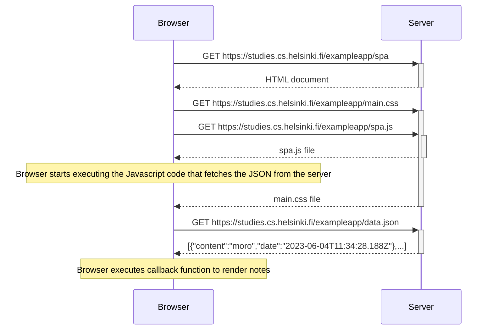

```mermaid
sequenceDiagram
    Participant B as Browser
    Participant S as Server
        B->>+S: GET https://studies.cs.helsinki.fi/exampleapp/spa
        S-->>-B: HTML document
        B->>+S: GET https://studies.cs.helsinki.fi/exampleapp/main.css
        B->>+S: GET https://studies.cs.helsinki.fi/exampleapp/spa.js
        S-->>-B: spa.js file
        Note over B: Browser starts executing the Javascript code that fetches the JSON from the server
        S-->>-B: main.css file
        B->>+S: GET https://studies.cs.helsinki.fi/exampleapp/data.json
        S-->>-B: [{"content":"moro","date":"2023-06-04T11:34:28.188Z"},...]
        Note over B: Browser executes callback function to render notes
```
