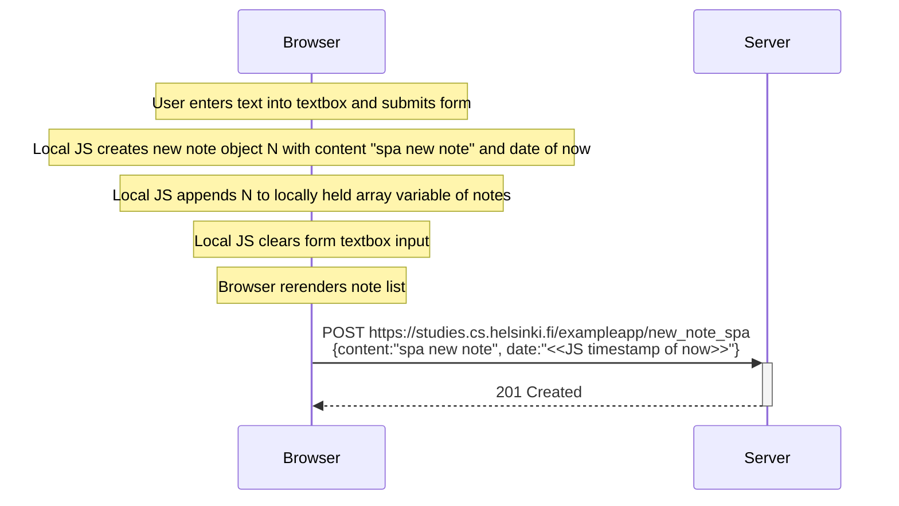

```mermaid
sequenceDiagram
    Participant B as Browser
    Participant S as Server
    Note over B: User enters text into textbox and submits form
    Note over B: Local JS creates new note object N with content "spa new note" and date of now
    Note over B: Local JS appends N to locally held array variable of notes
    Note over B: Local JS clears form textbox input
    Note over B: Browser rerenders note list
    B->>+S: POST https://studies.cs.helsinki.fi/exampleapp/new_note_spa<br>{content:"spa new note", date:"<<JS timestamp of now>>"}
    S-->>-B: 201 Created
```
